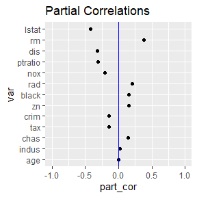
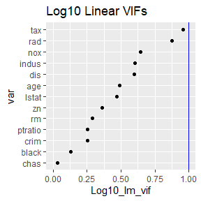
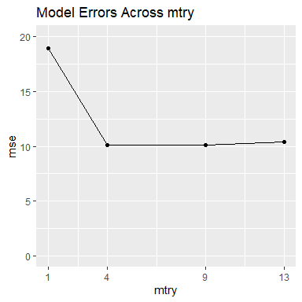
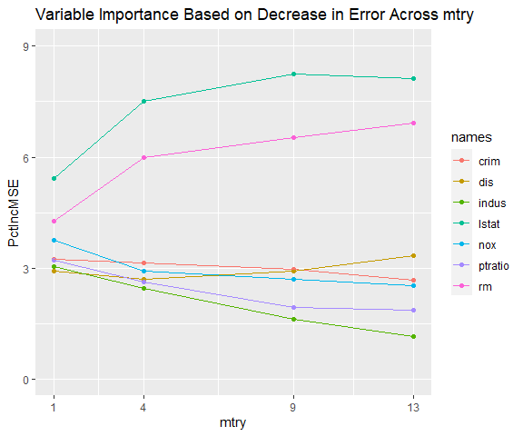
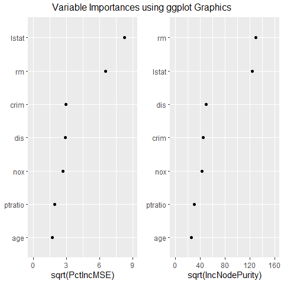

<!-- README.md is generated from README.Rmd. Please edit that file -->

# randomForestVIP

<!-- badges: start -->

[](https://github.com/KelvynBladen/randomForestVIP/actions/workflows/R-CMD-check.yaml)

<!-- badges: end -->

The goal of `randomForestVIP` is to tune and select a good Random Forest
model based on the accuracy and variable importance metrics associated
with each model. To accomplish this, functions are available to tabulate
and plot results designed to help the user select an optimal model.

This package contains functions for assessing variable relations and
associations prior to modeling with a Random Forest algorithm (although
these are relevant for any predictive model). Metrics such as partial
correlations and variance inflation factors are tabulated as well as
plotted for the user using the functions `partial_cor` and
`robust_vifs`.

The function `mtry_compare` is available for tuning the hyper-parameter
mtry based on model performance and variable importance metrics. This
grid-search technique provides tables and plots showing the effect of
mtry on each of the assessment metrics. It also returns each of the
evaluated models to the user.

The package also provides superior ggplot2 variable importance plots for
individual models using the function `ggvip`. This function is a highly
aesthetic and editable improvement upon the function
`randomForest::varImpPlot` and other basic importance graphics.

All of the plots generated by these functions are developed with ggplot2
techniques so that the user has the ability to edit and improve further
upon the plots.

For methodology see “Contributions to Random Forest Variable Importance
with Applications in R” <https://digitalcommons.usu.edu/etd/8587/>.

## Installation

You can install the released version of `randomForestVIP` from
[CRAN](https://CRAN.R-project.org) with:

``` r
install.packages("randomForestVIP")
```

You can install the development version of `randomForestVIP` from
[GitHub](https://github.com/) with:

``` r
# install.packages("devtools")
devtools::install_github("KelvynBladen/randomForestVIP")
```

You can view R package’s source code on GitHub:
<https://github.com/KelvynBladen/randomForestVIP>

## Example

``` r
library(randomForestVIP)
library(MASS)
library(EZtune)
```

To introduce the functionality of `randomForestVIP`, we look at modeling
the Boston housing data (found in the MASS package). We want to build a
Random Forest model with a view towards both accuracy and
interpretability. We begin by running some preliminary diagnostics on
our data.

``` r
set.seed(1234)

pcs <- partial_cor(medv ~ ., data = Boston, model = lm)
pcs$plot_y_part_cors
```



``` r

rv <- robust_vifs(medv ~ ., data = Boston, model = lm)
rv$plot_lin_vifs
```



These functions assess concerns with collinearity. Notice that the VIFs
from `robust_vifs` are all less than 10. The partial correlations with
the response from `partial_cor` are a type of pseudo-importance
assessing the importance each variable does not share with the others.
Now we tune our model by assessing four different mtry values in the
`mtry_compare` function.

``` r
set.seed(1)
m <- mtry_compare(medv ~ .,
  data = Boston, sqrt = TRUE,
  mvec = c(1, 4, 9, 13), num_var = 7
)
m$gg_model_errors
```



``` r
m$model_errors
#>   mtry      mse
#> 1    1 18.96051
#> 2    4 10.11247
#> 3    9 10.13187
#> 4   13 10.36482
```

According to the accuracy plot and table above, our best choice is when
mtry is 4. However, the accuracy for the best model is notably only
slightly better than the models with mtry set to 9 and 13. We now look
at the variable importance metrics across the different models.

``` r
m$gg_var_imp_error
```



The top two variables are consistently identified as more important than
the other variables and their order remains unchanged across mtry.
However, the variables ‘nox’ and ‘dis’ switch order as mtry increases.
Pollution (nox) has a strong negative correlation with distance to
employment centers (dis). This makes sense if the employment centers are
responsible for much of the pollution. If many home buyers consider
distance to work more important than pollution when selecting a house,
‘dis’ is more likely to be a causal driver of price than ‘nox’. By this
reasoning, the model where mtry is 9 appears to be superior to the model
where mtry is 4, despite mtry of 4 yielding slightly more accurate
results.

We now take our selected model and build individual importance plots for
it using `ggvip`.

``` r
g <- ggvip(m$rf9, num_var = 7)$both_vips
```



The plot above resembles a standard variable importance plot, but
possesses superior tick labels and editing capabilities for the analyst.

We have used the `randomForestVIP` package to tune a strong model for
prediction and with reasonably useful importance values. This was
accomplished by assessing variable importance and accuracy metrics
across the hyper-parameter mtry.
